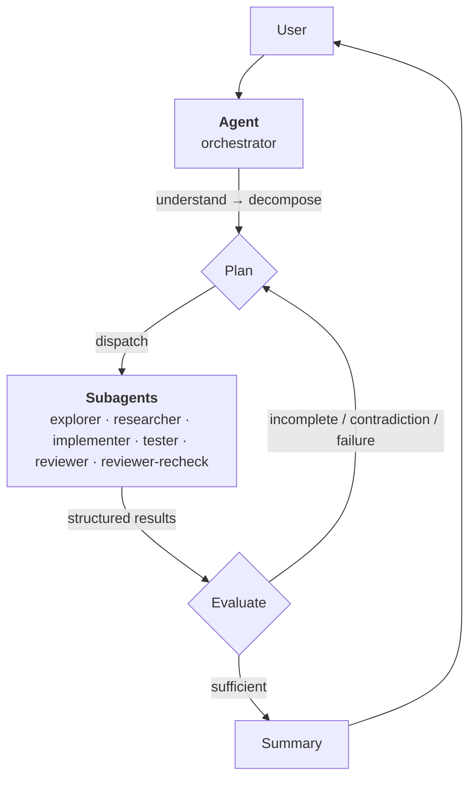

# Orchestrator

A skill to orchestrate workflows with subagents.

## Installation

Install the skills with the [`skills`](https://github.com/vercel-labs/skills) CLI:

```sh
skills add alpheusagents/orchestrator
```

## Usage

Trigger the skill by natural phrasing:

```text
orchestrate a review for this project
```

```text
work on it with sub-agents driven
```

Optionally, invoke it with `/orchestrate <task>`.

## Architecture



## Workers

| Worker           | Capability                  | Permission         |
| ---------------- | --------------------------- | ------------------ |
| explorer         | read-only inspection        | read-only          |
| researcher       | read-only, network research | read-only, network |
| implementer      | code editing                | safe-edit          |
| tester           | test execution              | execution          |
| reviewer         | independent review          | read-only          |
| reviewer-recheck | fix verification            | read-only          |

## License

This project is licensed under the terms of the MIT license.
